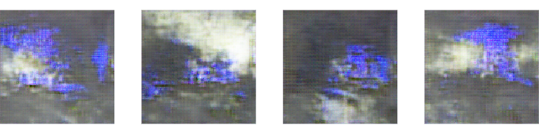
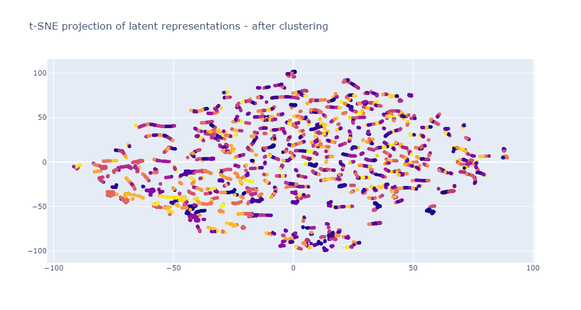

# __vari'art__

[](https://opensource.org/licenses/MIT)
[](https://github.com/hugros-93/kichtai/actions/workflows/main.yml)

Use generative models to perform image latent analysis and generate new images.

- Set of tools for the preprocessing of videos or sets of images
- Train a GAN or a VAE using __tensorflow__
- Perform latent space analysis, generate new images and create GIFs

<p align="center">
  
</p>


Easy loading and preprocessing of a video
```python
# Load video
name = 'DrillFR4' 
filename = 'inputs/DrillFR4.mp4'
DrillFR4 = ArtVideo(name, filename)
DrillFR4.load_video()

# Crop images as squares
DrillFR4.square()

# Resize images
size = 128
new_shape=(size,size)
DrillFR4.resize(new_shape=new_shape)

# Rescale pixels in (0,1)
DrillFR4.rescale_image()
```

Define and train a GAN using `tensorflow`
```python
# Create GAN object
gan_model = GAN(name_model, noise_dim, input_shape_tuple, generator, discriminator)

# Train GAN
gan_model.train(train_dataset)

# Generate images
gan_model.generate_and_plot(n_to_plot=4)
```
`output:`

<p align="center">
  
</p>

Define and train a VAE using `tensorflow`
```python
# Model definition
vae_model = VAE(DrillFR4.name, latent_dim, input_shape, inference_net, generative_net)

# Train
vae_model = vae_model.train(optimizer, train_dataset, validation_dataset, epochs, batch_size)
```

Once trained, it is possible to project all images in the latent space and perform clustering.
Each point represents an image, similar images are clustered together as they are close in the latent space. 

<p align="center">
  
</p>

```python
# Show images for clusters
for label in [3, 4, 8]:
    list_id = [i for i,l in enumerate(clusterer.labels_) if l==label][0:5]
    LatentDrillFR4.plot_encoded_decoded(list_id=list_id)
```
`output:`

**label_3**


**label_4**


**label_8**


By sampling in the latent space, it is possible to generate new images through decoding.
The continuity of the latent space allows for a step by step path from an image to another, decoding at each step transitions in order to generate a GIF.

```python
# Generate images by sampling from distributions in the latent space
list_z, _ = LatentDrillFR4.generate_image(n=5, method='dist')

# Create a GIF from generated images
filename = f"outputs/gif_DrillFR4.gif"
LatentDrillFR4.create_gif(list_z, filename)
```
`output:`

<p align="center">
  
</p>


Sampling around an existing image distribution generate more or less similar images, depending on the standard deviation `c` used. 

```python
for c in [0, 1, 5, 10, 25]:
    list_z, fig = LatentDrillFR4.generate_image(n=5, method='from_id_img', c=c, id_image=325)
    fig.show()
```

`output:`


A complete example is available in `example.py`.

_References:_
- *https://www.tensorflow.org/tutorials/generative/cvae*